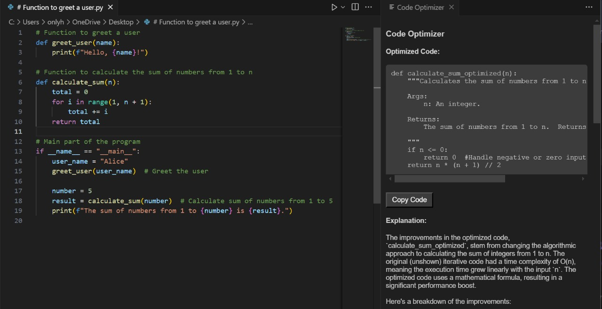
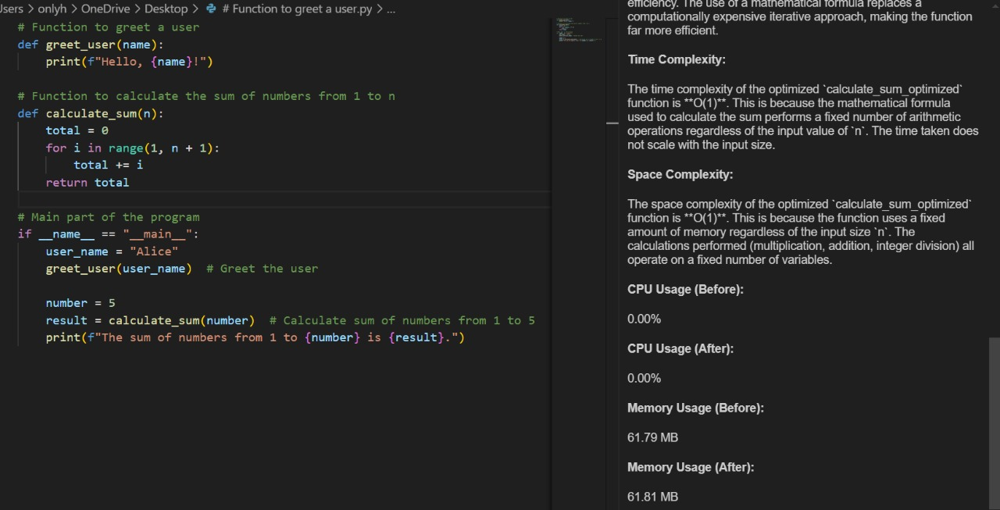

# Tweax - Real-Time Code Performance Optimizer


Tweax is a **VS Code extension** that optimizes Python code in real time, providing performance improvements, complexity analysis, and suggestions. It integrates with a **Flask server** powered by the **Gemini API** to enhance code efficiency dynamically.

## 🚀 Features

✅ **Real-time Code Optimization** – Improves code performance dynamically.  
✅ **Performance Analysis** – Displays CPU and memory usage.  
✅ **Time & Space Complexity** – Provides Big-O analysis for the optimized code.  
✅ **Explanations** – Understand the optimizations with detailed insights.  
✅ **Seamless VS Code Integration** – Optimize code directly within the editor.

---

## 📌 Installation

### 1️⃣ Install Tweax Locally

#### **Clone the Repository:**
```sh
git clone https://github.com/D-Vika-shan/Tweax.git
cd Tweax
```

#### **Install Dependencies:**
```sh
npm install
```

#### **Package the Extension:**
```sh
vsce package
```

#### **Install the Extension in VS Code:**
```sh
code --install-extension tweax-0.0.1.vsix
```

---

## ⚙️ Usage

### **1️⃣ Start the Flask Server**
Ensure Python and Flask are installed, then run:
```sh
python code_optimizer.py
```

### **2️⃣ Optimize Code in VS Code**
- Select a piece of Python code.
- Right-click and choose **"Optimize Selection"**.
- View the optimized version, complexity analysis, and performance scores.


---

## 🛠 Configuration

### **Environment Variables (.env)**
Create a `.env` file in the project root and add your **Gemini API Key**:
```
GENAI_API_KEY=your_api_key_here
```

---

## 🔧 Development

### **Running the Extension in Debug Mode**
1. Open the project in VS Code.
2. Press `F5` and select `Run Extension`.
3. A new VS Code instance will launch with Tweax enabled.

### **Linting & Testing**
```sh
npm run lint   # Linting
npm run test   # Run tests
```

---

## 📜 License
This project is licensed under the [MIT License](LICENSE).


